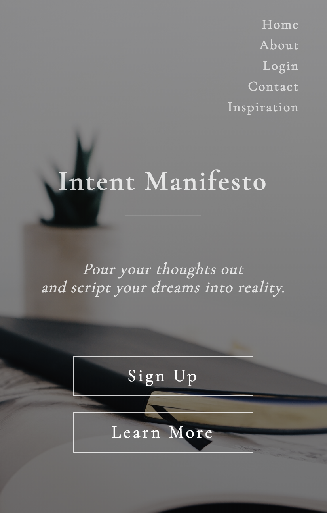
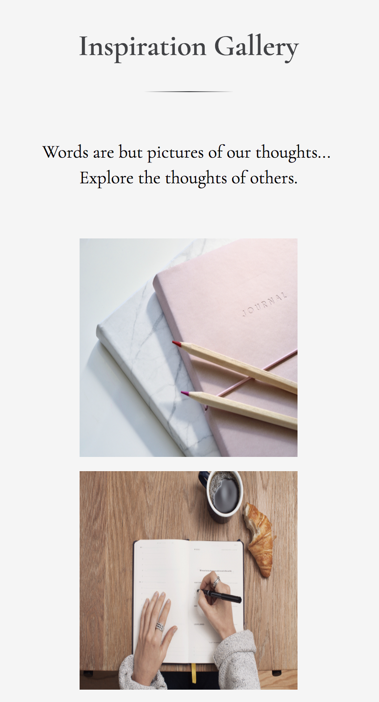
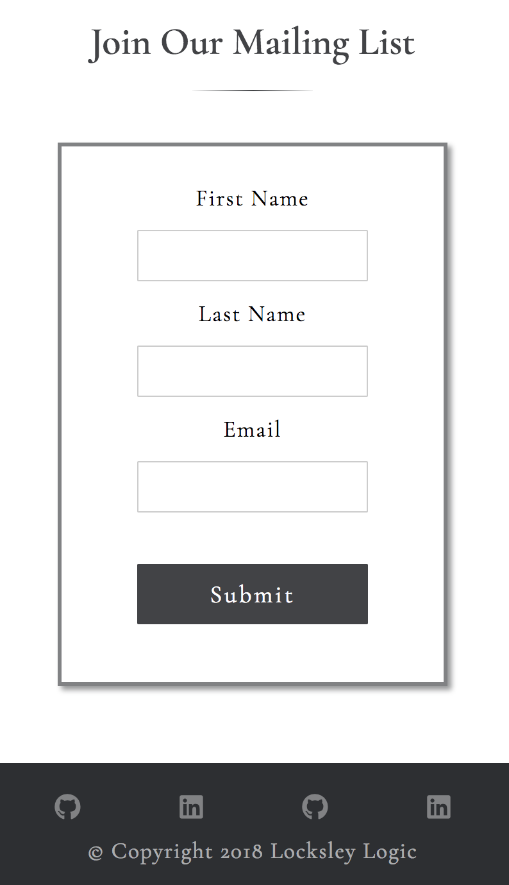

# IntentManifestoApp
## Intent Manifesto App - Design Build In Progress
- Not yet sized for screens larger than 400px - Responsive Design Coming Soon

## What is Intent Manifesto
### Intent Manifesto is a place for those to visualize their goals, dreams, ideas, and most intimate thoughts into reality.

## Inspired By
- Chris Aquino | Digitial Crafts Instructor | Class Demo Note Todo App 
- Modern Bullet Journals
- Revamped into personalized manifesto for all to express their indiviuality, art, intention, and creativity.

## Built By April Copes and Lauren Wilkerson
All design layouts are original layout ideas. No libraries or frameworks were used for layout design. Layouts were built in pure HTML and CSS.

## Teachnologies Used
- HTML5
- CSS3
- Node.js
- SQL
- JavaScript
- Express

