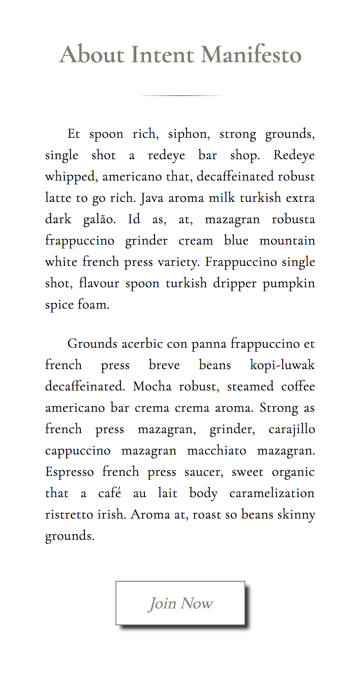

# IntentManifestoApp
## Intent Manifesto App in Progress
- Not yet sized for screens larger than 400px - Responsive Design Coming Soon

## What is Intent Manifesto
### Intent Manifesto is a place for those to visualize their goals, dreams, ideas, and most intimate thoughts into reality.

## Teachnologies Used
- HTML5
- CSS3
- Node.js
- SQL
- JavaScript
- Express

## Built By
All design layouts are original layout ideas by April Copes and Lauren Wilkerson. No libraries or framworks were used for layout design. Layouts Built in pure HTML and CSS

## Technologies Used
HTML
CSS
Node.js
JavaScript
SQL
Express

## Inspired By
Chris Aquino | Digitial Crafts Instructor class demo of a note todo app revamped into personalized manifesto of indiviuality, art, intention, and creativity. Also inspired by modern bullet journals.
